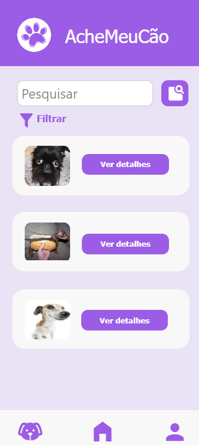
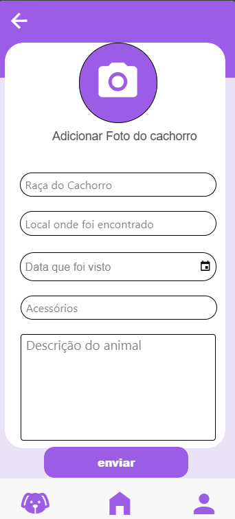
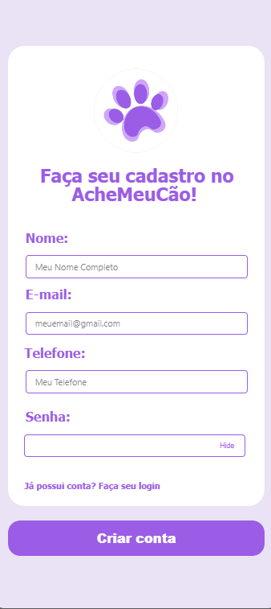
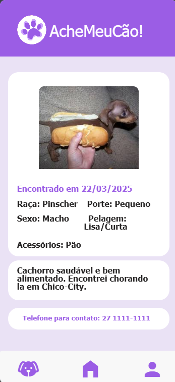
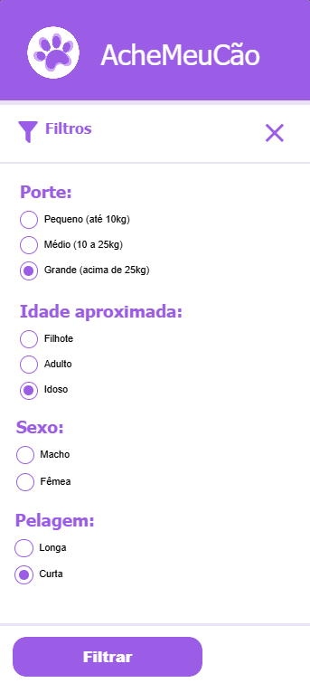
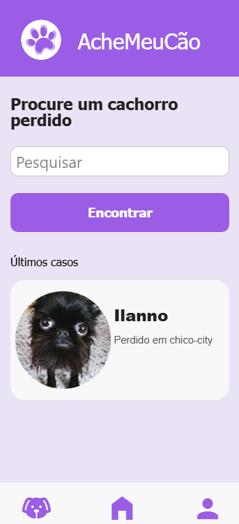
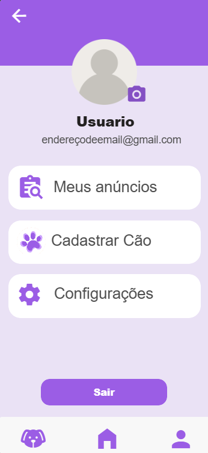

# AcheMeuCão  🐾 
Aplicativo para ajudar a encontrar cães perdidos e conectar tutores com pessoas que possam ter visto seus pets.

## 👤 COMPONENTES 

> Ilanna dos Reis Cardoso  
Erick Machado Ferreira  

... 
## 📱 PROTÓTIPOS:  

 

## 💻 FRONT-END:  

 

## 📸 Protótipo

  &nbsp;
  &nbsp;
  &nbsp;
  &nbsp;
  &nbsp;
  &nbsp;
  &nbsp;
  

## ✨ Funcionalidades
- 📍 Cadastro de cães perdidos
- 🔍 Busca dos cães
- 📸 Upload de fotos do pet
  

## 🚀 Como Rodar
1. Utilize o link
https://github.com/Lanaaa22/AcheMeuCAO/html (por agora)

